# Cinnamon Export Sales Forecasting - Project Walkthrough

This document is written for an examiner or reviewer opening the repository to understand what the project does, how it was built, how to reproduce the outputs, and how to review the modeling decisions.

The project was developed with a spec-driven workflow. The main traceability sources are:

- [Constitution](../.specify/memory/constitution.md)
- [Main forecasting spec](../specs/001-cinnamon-export-forecasting/spec.md)
- [Feature-engineering fix spec](../specs/002-feature-engineering-fixes/spec.md)
- [Completion spec](../specs/003-complete-forecasting-submission/spec.md)
- [Run and submission guide](run-and-submission-guide.md)
- [Dataset access note](DATA_ACCESS.md)
- [Submission report](submission/report.md)

Note: generated data and outputs are local artifacts in this working tree. The raw workbook, processed Parquet files, forecasts, and figures are not suitable for committing to a public repository without an explicit data-sharing decision.

## 1. Project Summary

This project forecasts weekly `Sales Qty` for cinnamon export products using transaction-level export sales data. The final output is a product-level 12-week forecast file:

- Forecast target: weekly `Sales Qty`
- Forecast horizon: 12 weeks
- Input: transaction-level export sales workbook
- Output: product-level 12-week forecast CSV
- Final forecast file: [`../outputs/forecasts/forecast_12wk.csv`](../outputs/forecasts/forecast_12wk.csv)
- Verified final forecast coverage: 108,624 rows, 9,052 products, 12 forecast rows per product
- Verified forecast dates: 2025-09-22 through 2025-12-08

The project uses a tiered approach:

- High-volume products are modeled with global tabular machine-learning models over engineered features.
- Sparse/intermittent products are modeled with intermittent-demand statistical methods and a naive baseline.
- A small country-level drill-down is included as a demo, not as a full production country-level model.

## 2. Problem Statement

The project forecasts weekly product demand for a cinnamon exporter. The business problem is not just "predict next sales", because the source data is transactional and uneven:

- Many products have only a few transactions.
- Demand is intermittent, with long zero-sales periods.
- Some products have export spikes rather than smooth weekly demand.
- Destination-country splits are limited. The verified in-scope maximum is 2 countries per product, and 0 in-scope products have 3 or more countries.
- Non-cinnamon merchandise and rubber/latex product categories appear in the raw workbook and must not be included in the cinnamon forecast.

Weekly forecasting is useful because it converts irregular transactions into a planning horizon that can be reviewed, validated, and submitted as a 12-week product-level forecast.

## 3. Dataset Overview

Verified from the current repo artifacts and raw workbook:

| Fact | Verified value | Reference |
|---|---:|---|
| Raw rows | 60,670 | [`../data/raw/Cinnamon_export_sales.xlsx`](../data/raw/Cinnamon_export_sales.xlsx), [`../src/cleaning.py`](../src/cleaning.py) |
| Raw columns | 14 | raw workbook |
| Real regions after removing export-artifact rows | 17 | raw workbook, [`../notebooks/01_eda_raw.ipynb`](../notebooks/01_eda_raw.ipynb) |
| Destination countries in raw post-artifact data | 91 | raw workbook |
| Raw order-date range after artifact removal | 2022-02-28 to 2025-09-17 | raw workbook |
| Product codes in post-artifact data | 13,733 | raw workbook |
| ProductIDs from first 9 chars of `Product Code` | 13,724 | raw workbook, [`../src/cleaning.py`](../src/cleaning.py) |
| Cleaned transaction rows | 60,646 | [`../data/processed/cleaned.parquet`](../data/processed/cleaned.parquet) |
| In-scope cinnamon rows | 50,995 | [`../data/processed/scoped.parquet`](../data/processed/scoped.parquet) |
| In-scope products | 9,052 | [`../data/processed/scoped.parquet`](../data/processed/scoped.parquet) |
| Scoped countries | 87 | [`../data/processed/scoped.parquet`](../data/processed/scoped.parquet) |
| Scoped regions | 15 | [`../data/processed/scoped.parquet`](../data/processed/scoped.parquet) |

Main raw columns used:

`Region`, `Country`, `Customer Code`, `Customer ID`, `Brand Category`, `Product Range`, `Sales Channel`, `Product Code`, `Order Date`, `Invoice Date`, `Invoice No`, `Sales USD`, `Sales Qty`, `Sales KG`.

Documented assignment-brief discrepancies:

- The assignment brief says 19 regions, but the verified source data has 17 real regions after removing export-artifact rows.
- The approved spec records the top-100 in-scope product volume share as 50.1%, not the higher concentration implied by the brief.

## 4. Data Cleaning and Scoping

Cleaning is implemented in [`../src/cleaning.py`](../src/cleaning.py). Product scoping is implemented in [`../src/scoping.py`](../src/scoping.py).

| Step | What was done | Why it matters | Code/output reference |
|---|---|---|---|
| Remove export-artifact rows | Dropped 3 known spreadsheet/export artifact rows at indices 60667, 60668, 60669 | Prevents pivot/footer metadata from being counted as transactions or regions | [`../src/cleaning.py`](../src/cleaning.py), `ARTIFACT_INDICES` |
| Remove duplicates | Removed 21 exact duplicate rows after artifact removal | Prevents duplicated transactions from inflating sales | [`../src/cleaning.py`](../src/cleaning.py), [`../data/processed/cleaned.parquet`](../data/processed/cleaned.parquet) |
| Handle missing `Order Date` | Imputed 139 missing `Order Date` values using median lead time from rows with both order and invoice dates | Keeps real transactions while preserving a demand-time anchor | [`../src/cleaning.py`](../src/cleaning.py) |
| Derive `ProductID` | `ProductID` is the first 9 characters of `Product Code` | Matches the assignment identifier rule | [`../src/cleaning.py`](../src/cleaning.py) |
| Scope to cinnamon products | Excluded non-cinnamon merchandise and rubber/latex `Product Range` rows | Keeps model and metrics focused on cinnamon demand | [`../src/scoping.py`](../src/scoping.py) |
| Preserve split-category products | Exclusion is row-level, not whole-product, for known split-category ProductIDs | Avoids dropping valid cinnamon rows because the same ProductID also appears in an excluded category | [`../src/scoping.py`](../src/scoping.py) |
| Treat negative quantities as returns | Weekly product totals are netted; negative product-week totals are floored to 0 and flagged | Keeps returns visible without producing negative demand targets | [`../src/cleaning.py`](../src/cleaning.py), [`../data/processed/weekly.parquet`](../data/processed/weekly.parquet) |

Verified current cleaning/scoping counts:

- Export-artifact rows removed: 3
- Duplicate rows removed: 21
- Missing `Order Date` values imputed: 139
- Excluded post-cleaning rows: 9,651
- Scoped cinnamon rows: 50,995
- Scoped cinnamon products: 9,052
- Scoped negative `Sales Qty` rows before weekly aggregation: 101
- Product-weeks where returns exceeded sales and were floored to 0: 98

## 5. Weekly Aggregation

The raw workbook is transaction-level, so it is converted to weekly product-level demand.

Weekly aggregation is implemented in [`../src/cleaning.py`](../src/cleaning.py), function `aggregate_weekly()`.

Verified weekly output:

- File: [`../data/processed/weekly.parquet`](../data/processed/weekly.parquet)
- Rows: 47,803
- Products: 9,052
- Week range: 2022-02-28 to 2025-09-15
- Grouping key: `ProductID` + `WeekStart`
- `WeekStart`: Monday week start derived from `Order Date`
- `Sales_Qty`: summed at product-week level, floored at 0 if net returns exceed sales
- `Sales_USD`: summed at product-week level
- `transaction_count`: count of transactions in the product-week
- Categorical columns: mode value per product-week for `Region`, `Country`, `Sales Channel`, `Brand Category`, `Product Range`

Zero-sales weeks are represented in the feature stage, not by raw weekly rows. [`../src/features.py`](../src/features.py) builds a complete product-week panel from each product's first observed week through the global last observed week and fills missing product-weeks with `Sales_Qty = 0`. These zero-sales weeks are treated as real no-demand periods after product launch, not missing values. Pre-launch weeks are not fabricated; this was fixed and tested in spec 002.

## 6. Feature Engineering

Feature engineering is implemented in [`../src/features.py`](../src/features.py).

Verified feature output:

- File: [`../data/processed/featured.parquet`](../data/processed/featured.parquet)
- Rows: 1,095,257
- Columns: 30
- Products: 9,052
- Week range: 2022-02-28 to 2025-09-15
- Zero-sales row share: 0.9564494908500927

| Feature group | Example columns | Meaning | Why useful |
|---|---|---|---|
| Lag features | `Sales_Qty_lag_1`, `Sales_Qty_lag_2`, `Sales_Qty_lag_4`, `Sales_Qty_lag_12` | Past weekly sales quantities | Captures recent and seasonal demand signals |
| Rolling mean | `Sales_Qty_rollmean_4`, `Sales_Qty_rollmean_12` | Average past demand over 4 or 12 weeks | Smooths noisy weekly demand |
| Rolling standard deviation | `Sales_Qty_rollstd_4`, `Sales_Qty_rollstd_12` | Recent demand volatility | Helps distinguish stable products from spike-driven products |
| Calendar features | `month`, `week_of_month`, `quarter`, `week_of_year`, `is_year_end` | Calendar position of each week | Captures seasonal and year-end effects |
| Holiday features | `is_lk_holiday_week` | Whether the week contains a Sri Lankan holiday | Adds a simple origin-market calendar signal |
| Sparse-demand features | `zero_streak_length`, `cumulative_zero_weeks` | Consecutive and cumulative zero-sales behavior | Helps describe intermittent demand |
| Unit price | `unit_price` | `Sales_USD / Sales_Qty` when quantity is positive | Provides a rough price signal |
| Categorical features | `ProductID`, `Region`, `Country`, `Sales Channel`, `Brand Category`, `Product Range` | Product and transaction context | Supports global tabular modeling across many products |

No-leakage checks:

- Lag features use prior weeks only.
- Rolling mean/std are computed after `.shift(1)`, so the current target is not included.
- [`../tests/test_features.py`](../tests/test_features.py) includes a mutation-based leakage test: changing the current row's `Sales_Qty` must not change that row's rolling features.
- Validation is time-ordered. Future validation weeks are not used to train the Fold 1 model.

## 7. Tiering Strategy

Tiering is implemented in [`../src/tiering.py`](../src/tiering.py).

The project does not use one model for every product because the product catalog has very different demand densities. Some products have enough transaction history for a global feature-based model, while many products are intermittent or nearly one-off.

Verified threshold:

- High-volume threshold: transaction count >= 10
- Sparse threshold: transaction count <= 9
- Total in-scope products: 9,052
- High-volume volume share: 0.7942376865313594

| Tier | Definition | Product count | Modeling strategy | Reason |
|---|---|---:|---|---|
| `high_volume` | Product transaction count >= 10 | 1,525 | LightGBM, XGBoost, seasonal-naive baseline | Enough repeated history for a global tabular model |
| `sparse` | Product transaction count < 10 | 7,527 | CrostonClassic, CrostonSBA, TSB, Naive baseline | Many zero weeks and few demand events; intermittent-demand methods are more appropriate |

The tier split is a strict partition. Every in-scope product appears in exactly one tier in [`../data/processed/tiers.parquet`](../data/processed/tiers.parquet).

## 8. High-Volume Modeling

High-volume modeling is implemented in [`../src/models/high_volume.py`](../src/models/high_volume.py).

Verified setup:

- Products: 1,525
- Models trained: LightGBM, XGBoost, seasonal-naive baseline
- Fold 1 train period: weeks <= 2025-06-23
- Fold 1 validation period: 2025-06-30 through 2025-09-15
- Validation length: 12 weeks
- Validation rows: 18,300 per model
- Final high-volume forecast candidates: 54,900 rows, or 1,525 products x 12 weeks x 3 models
- Final selected high-volume model in assembled forecast: `lightgbm`

Why these models:

- LightGBM and XGBoost fit tabular engineered features and can model nonlinear interactions across products.
- A global model lets many product series share information instead of training tiny per-product models.
- Seasonal-naive provides a simple baseline using lag-12 behavior.

Verified high-volume results from [`../outputs/metrics/model_comparison.csv`](../outputs/metrics/model_comparison.csv):

| Model | RMSE | MAE | Train time (s) | Inference time (s) |
|---|---:|---:|---:|---:|
| LightGBM | 150.433073 | 15.887949 | 1.439151 | 0.076476 |
| XGBoost | 155.958547 | 15.581272 | 1.387919 | 0.036962 |
| Seasonal-naive baseline | 360.582019 | 54.834973 | 0.000000 | 0.002678 |

Both LightGBM and XGBoost beat the seasonal-naive baseline on Fold 1. LightGBM was selected for the assembled forecast because it has the better RMSE among the machine-learning candidates.

## 9. Sparse / Intermittent-Demand Modeling

Sparse modeling is implemented in [`../src/models/sparse.py`](../src/models/sparse.py).

Sparse products have many zero weeks and few demand events. Normal feature-based ML is less reliable for this tier because many products do not have enough repeated signal. The sparse tier therefore uses statistical intermittent-demand methods plus a simple baseline.

Verified setup:

- Products: 7,527
- Models run: CrostonClassic, CrostonSBA, TSB, Naive
- Input format: `unique_id=ProductID`, `ds=WeekStart`, `y=Sales_Qty`
- Frequency: `W-MON`
- Forecast horizon: 12 weeks
- Final sparse forecast candidates: 361,296 rows, or 7,527 products x 12 weeks x 4 models
- Final selected sparse model in assembled forecast: `TSB`

Model explanation:

- Naive = simple baseline rule.
- CrostonClassic and CrostonSBA = statistical intermittent-demand methods.
- TSB = statistical intermittent-demand method that separately smooths demand size and demand occurrence probability.
- LightGBM/XGBoost = machine-learning models, used only in the high-volume tier.

Verified sparse results from [`../outputs/metrics/model_comparison.csv`](../outputs/metrics/model_comparison.csv):

| Model | WMAPE | MASE | Train time (s) | Inference time (s) | Baseline? |
|---|---:|---:|---:|---:|---|
| CrostonClassic | 21.365578 | 36.109609 | 2.079166 | 2.079166 | No |
| CrostonSBA | 20.344390 | 34.436478 | 2.079166 | 2.079166 | No |
| TSB | 3.144757 | 3.111856 | 2.079166 | 2.079166 | No |
| Naive | 2.008995 | 2.953918 | 2.079166 | 2.079166 | Yes |

Honest finding: the Naive baseline beat all three intermittent-demand methods on this single Fold 1 validation window. This is not hidden. TSB was selected for the assembled sparse forecast because it was the best-performing non-baseline intermittent-demand method, but the baseline result should be considered a key limitation.

Sparse timing note: `statsforecast` fits the sparse models in one batched call, so per-model train/inference timing is reported as the same stage-level aggregate for each sparse model in [`../src/backtest.py`](../src/backtest.py).

## 10. Why Deep Learning Was Not Used

Deep learning models such as LSTM, GRU, TFT, PyTorch, and TensorFlow were not used.

This was a deliberate project decision, not a claim that deep learning is bad. The reasons are:

- The project constitution explicitly disallows GPU/deep-learning training dependencies unless amended.
- The deliverable needed to be CPU-only, reproducible, local, and explainable.
- Many product series are sparse or irregular, with too little product-level signal for a deep sequence model without substantially more architecture and tuning.
- LightGBM/XGBoost and intermittent-demand methods are faster, easier to audit, and more proportionate to the dataset and academic evaluation criteria.

References:

- [Constitution: Disallowed Patterns](../.specify/memory/constitution.md)
- [Completion report](submission/report.md)
- [`../pyproject.toml`](../pyproject.toml), which contains no PyTorch, TensorFlow, LSTM, GRU, or GPU framework dependency

## 11. Validation Strategy

Validation is time-ordered. No random train/test split is used for forecast metrics.

Verified Fold 1 setup:

- Train through: 2025-06-23
- Validate on: 2025-06-30 through 2025-09-15
- Validation horizon: 12 weeks
- Forecast horizon: 12 weeks

Why this matters:

- Forecasting must simulate the future from the past.
- Random train/test splits can leak future behavior into training and produce misleadingly optimistic results.
- A 12-week validation window matches the final 12-week forecast horizon.

Limitation:

- Only one time-ordered fold is reported. The plan documented possible earlier expanding-window folds, but the implemented result uses the minimum accepted single Fold 1 holdout. This should be treated as a limitation when reviewing model robustness.

References:

- [`../src/models/high_volume.py`](../src/models/high_volume.py)
- [`../src/models/sparse.py`](../src/models/sparse.py)
- [`../src/backtest.py`](../src/backtest.py)
- [`../tests/test_backtest.py`](../tests/test_backtest.py)

## 12. Metrics

Metric functions are implemented in [`../src/metrics.py`](../src/metrics.py), and the comparison table is generated by [`../src/backtest.py`](../src/backtest.py).

| Metric | Used for | Meaning | Why useful |
|---|---|---|---|
| RMSE | High-volume tier | Square root of mean squared error | Penalizes large misses and is common for continuous forecasts |
| MAE | High-volume tier | Mean absolute error | Easier to interpret as average absolute quantity error |
| WMAPE | Sparse tier | Sum of absolute errors divided by sum of actual demand | Avoids per-row division by zero and is more stable than MAPE for sparse demand |
| MASE | Sparse tier | Error scaled against a naive forecast from training history | Gives a scale-adjusted comparison across products |

Plain MAPE is problematic for sparse demand because many actual values are zero. Division by zero makes row-level percentage errors undefined or misleading.

## 13. Results Summary

| Output | Value | Reference |
|---|---:|---|
| Cleaned rows | 60,646 | [`../data/processed/cleaned.parquet`](../data/processed/cleaned.parquet) |
| Scoped cinnamon rows | 50,995 | [`../data/processed/scoped.parquet`](../data/processed/scoped.parquet) |
| In-scope products | 9,052 | [`../data/processed/tiers.parquet`](../data/processed/tiers.parquet) |
| High-volume products | 1,525 | [`../data/processed/tiers.parquet`](../data/processed/tiers.parquet) |
| Sparse products | 7,527 | [`../data/processed/tiers.parquet`](../data/processed/tiers.parquet) |
| Featured rows | 1,095,257 | [`../data/processed/featured.parquet`](../data/processed/featured.parquet) |
| Weekly rows | 47,803 | [`../data/processed/weekly.parquet`](../data/processed/weekly.parquet) |
| Model comparison rows | 7 | [`../outputs/metrics/model_comparison.csv`](../outputs/metrics/model_comparison.csv) |
| Final forecast rows | 108,624 | [`../outputs/forecasts/forecast_12wk.csv`](../outputs/forecasts/forecast_12wk.csv) |
| Final forecast products | 9,052 | [`../outputs/forecasts/forecast_12wk.csv`](../outputs/forecasts/forecast_12wk.csv) |
| Rows per forecast product | 12 | [`../outputs/forecasts/forecast_12wk.csv`](../outputs/forecasts/forecast_12wk.csv) |
| Negative final predictions | 0 | [`../outputs/forecasts/forecast_12wk.csv`](../outputs/forecasts/forecast_12wk.csv) |
| Country demo rows | 72 | [`../outputs/models/country_demo/forecast.csv`](../outputs/models/country_demo/forecast.csv) |
| Figure files | 11 | [`../outputs/figures/`](../outputs/figures/) |

Final model choices:

- High-volume: LightGBM
- Sparse: TSB, with the explicit caveat that the Naive baseline performed better on Fold 1
- Country demo: rolling mean of the last up-to-4 observed weekly values

## 14. Forecast Output

Final forecast path:

[`../outputs/forecasts/forecast_12wk.csv`](../outputs/forecasts/forecast_12wk.csv)

Verified columns:

| Column | Meaning |
|---|---|
| `ProductID` | 9-character product identifier |
| `forecast_week` | Forecast step 1 through 12 |
| `WeekStart` | Monday-start forecast week |
| `predicted_Sales_Qty` | Nonnegative predicted sales quantity |
| `tier` | `high_volume` or `sparse` |
| `model` | Selected model used in the assembled forecast |

Verified coverage:

- 108,624 rows
- 9,052 unique products
- 12 rows per product
- Forecast dates 2025-09-22 through 2025-12-08
- `high_volume`: 18,300 rows using `lightgbm`
- `sparse`: 90,324 rows using `TSB`
- 0 negative predictions

How to inspect:

```bash
uv run python -c "import pandas as pd; df = pd.read_csv('outputs/forecasts/forecast_12wk.csv'); print(df.head()); print(df.groupby('tier').size())"
```

## 15. Plots and Report Figures

All images below exist under [`../outputs/figures/`](../outputs/figures/) in the current working tree. They are generated by [`../src/report_assets.py`](../src/report_assets.py).

### Actual vs Predicted

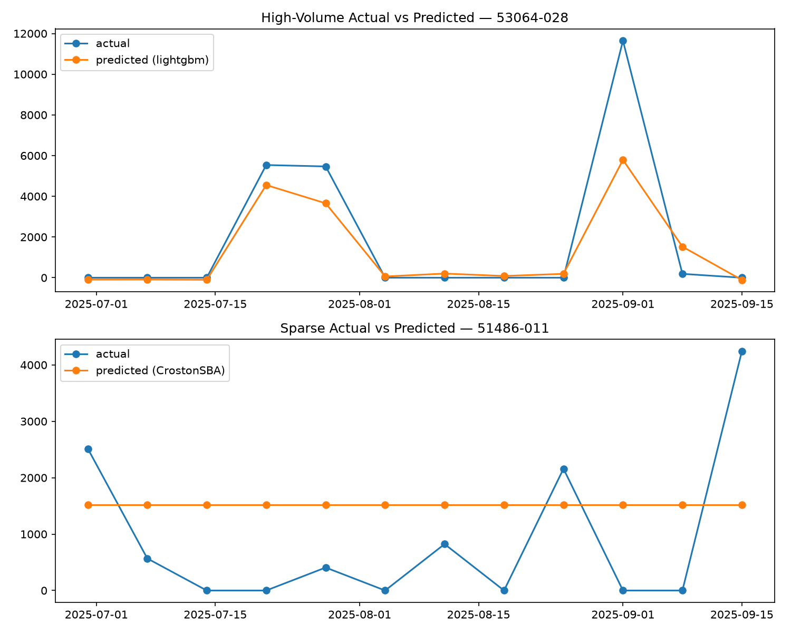

File: [`../outputs/figures/actual_vs_predicted.png`](../outputs/figures/actual_vs_predicted.png)

What it shows: one high-volume and one sparse example comparing held-out actuals against model predictions.

How to interpret: use it to visually check whether predictions follow the general level and shape of validation demand.

What not to overclaim: this is an example plot, not evidence that every product is well-fit.

### Correlation Heatmap

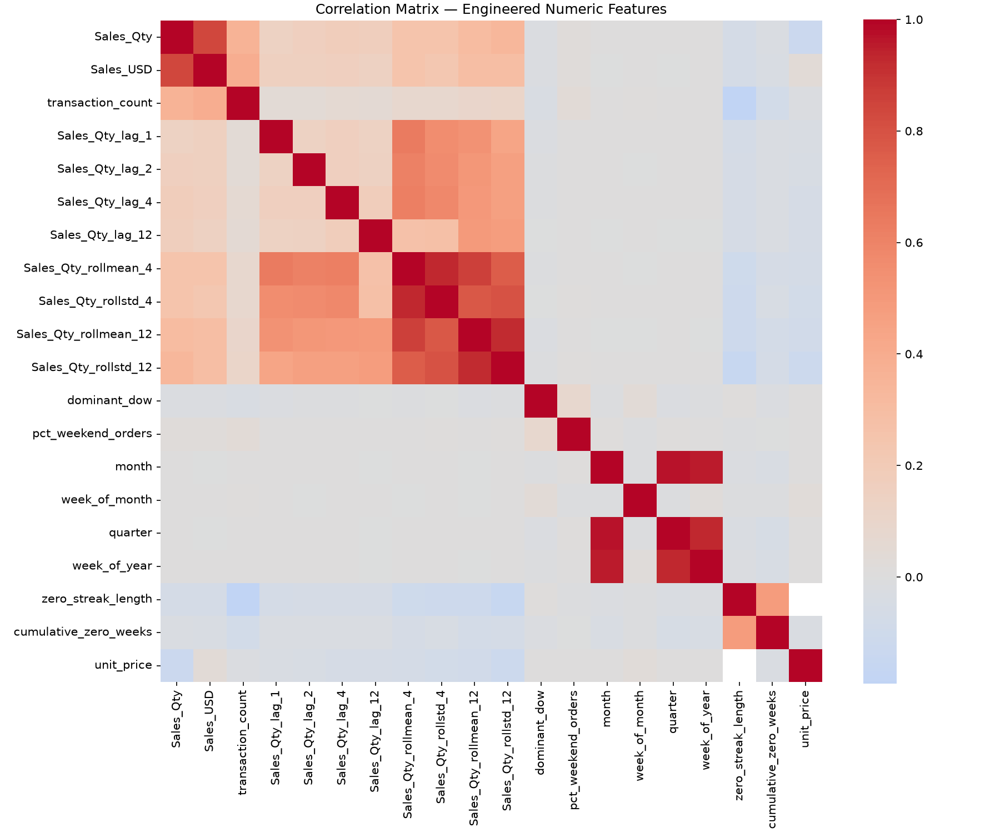

File: [`../outputs/figures/correlation_heatmap.png`](../outputs/figures/correlation_heatmap.png)

What it shows: correlations among engineered numeric features.

How to interpret: it highlights redundant or related feature groups, such as lags and rolling statistics.

What not to overclaim: correlation does not prove causal importance.

### Feature Importance

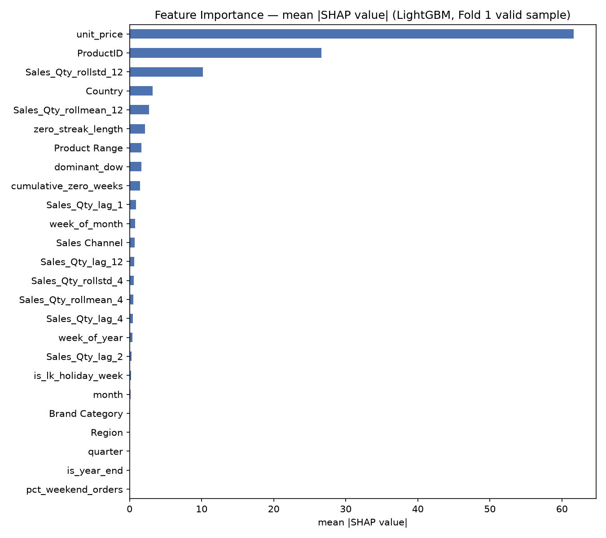

File: [`../outputs/figures/feature_importance.png`](../outputs/figures/feature_importance.png)

What it shows: SHAP-based feature importance for the LightGBM model using a deterministic 300-row Fold 1 validation sample.

How to interpret: larger mean absolute SHAP values indicate stronger model influence in that sample.

What not to overclaim: this is global importance over a sample, not a per-product causal explanation.

### Loss Curves

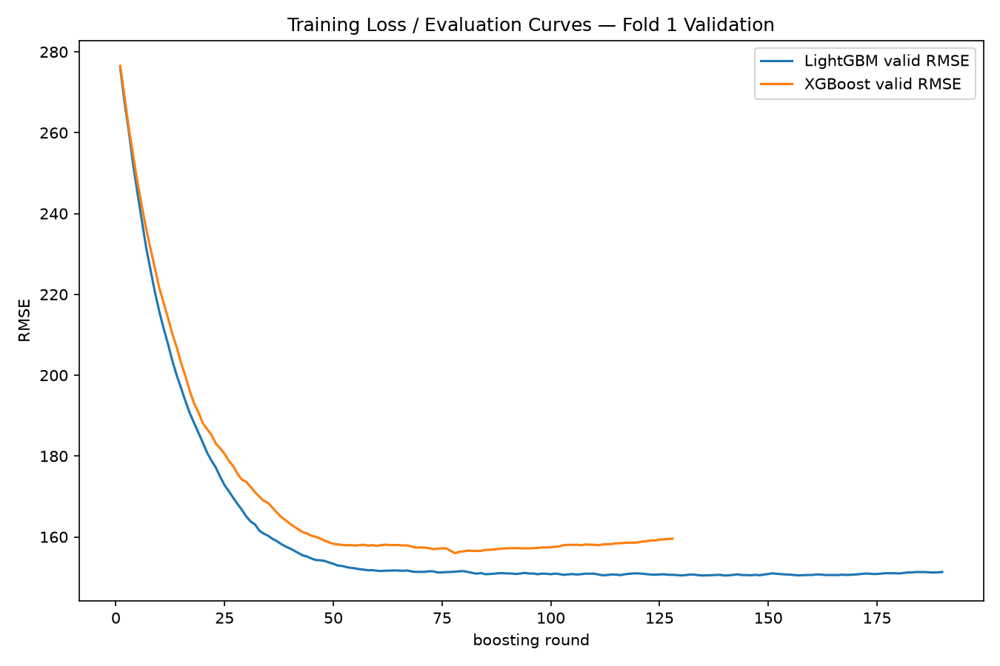

File: [`../outputs/figures/loss_curves.png`](../outputs/figures/loss_curves.png)

What it shows: LightGBM and XGBoost validation RMSE over boosting rounds.

How to interpret: it supports review of early stopping and whether validation loss stabilizes.

What not to overclaim: loss curves only cover the implemented Fold 1 validation setup.

### Sparse Zero Analysis

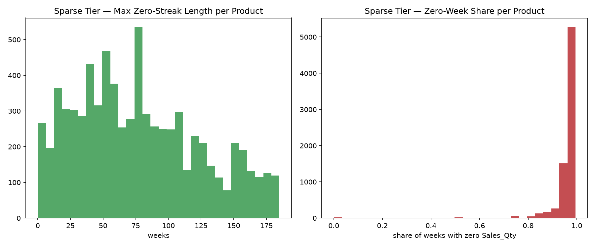

File: [`../outputs/figures/sparse_zero_analysis.png`](../outputs/figures/sparse_zero_analysis.png)

What it shows: sparse-tier zero-streak and zero-week-share behavior.

How to interpret: it explains why sparse products are treated differently from high-volume products.

What not to overclaim: it describes sparsity, not forecast accuracy by itself.

### Seasonal Decomposition

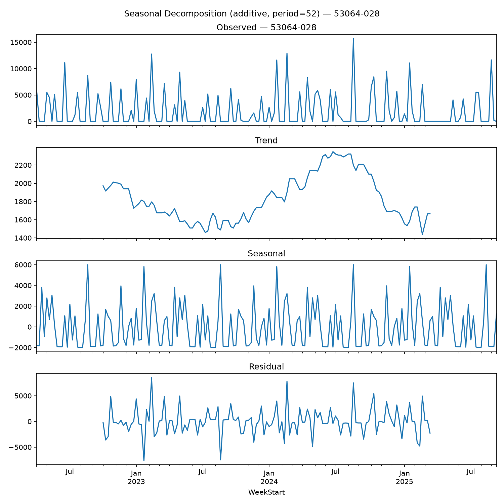

File: [`../outputs/figures/seasonal_decompose_53064-028.png`](../outputs/figures/seasonal_decompose_53064-028.png)

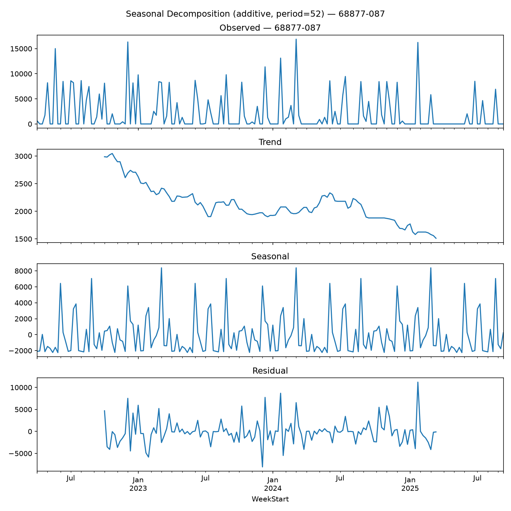

File: [`../outputs/figures/seasonal_decompose_68877-087.png`](../outputs/figures/seasonal_decompose_68877-087.png)

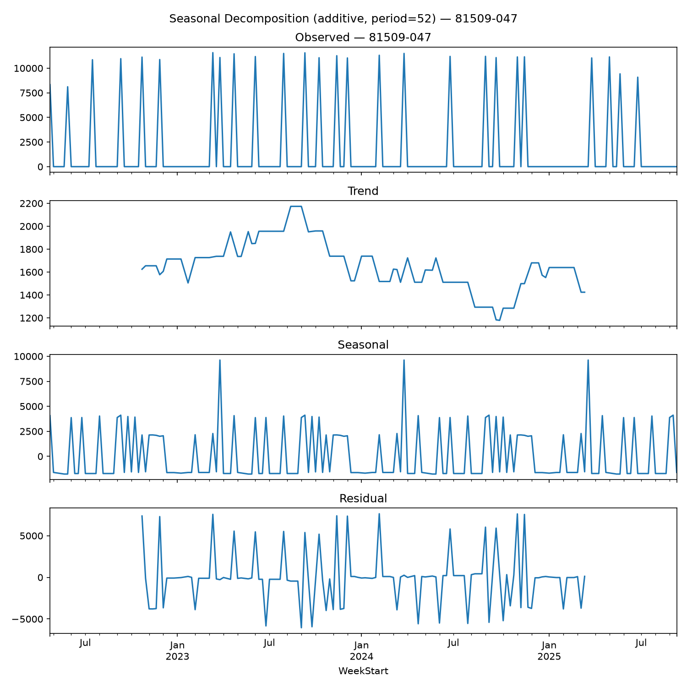

File: [`../outputs/figures/seasonal_decompose_81509-047.png`](../outputs/figures/seasonal_decompose_81509-047.png)

What they show: additive seasonal decomposition with period 52 for selected top-volume products with at least 104 weeks of history.

How to interpret: review trend, seasonal, and residual components for long-enough product series.

What not to overclaim: decomposition was only generated for selected products, not the full catalog.

### Year-over-Year Plots

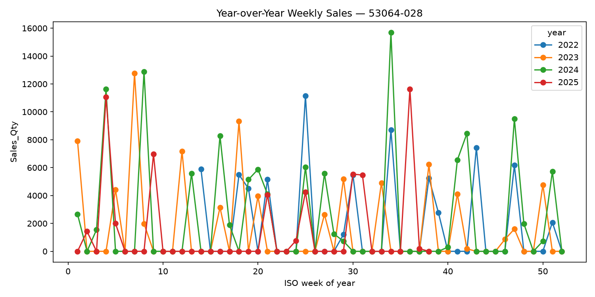

File: [`../outputs/figures/yoy_53064-028.png`](../outputs/figures/yoy_53064-028.png)

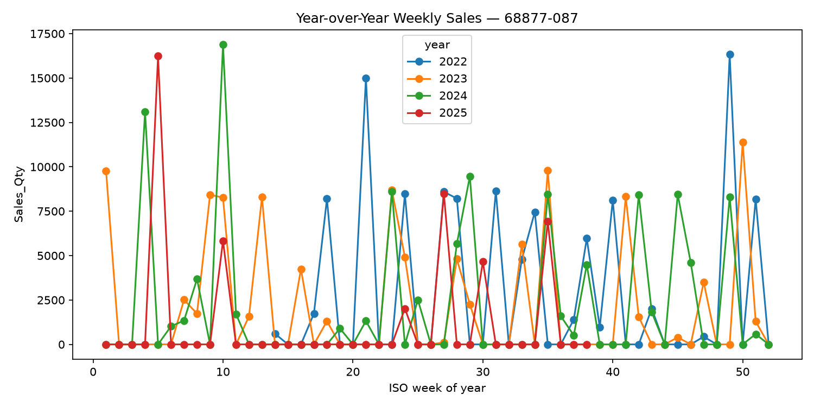

File: [`../outputs/figures/yoy_68877-087.png`](../outputs/figures/yoy_68877-087.png)

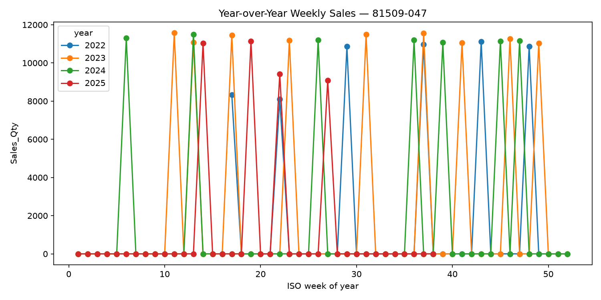

File: [`../outputs/figures/yoy_81509-047.png`](../outputs/figures/yoy_81509-047.png)

What they show: weekly demand overlaid by year for selected products.

How to interpret: useful for checking visible recurring seasonal patterns or year-specific spikes.

What not to overclaim: visual seasonality in a few products does not imply seasonality for all products.

## 16. Country Drill-Down Demo

Country-level forecasting is a limited demonstration, not a full production country-level model.

Implementation:

- Code: [`../src/models/country_demo.py`](../src/models/country_demo.py)
- Output: [`../outputs/models/country_demo/forecast.csv`](../outputs/models/country_demo/forecast.csv)
- Method: `rolling_mean_last_4_weeks`
- Forecast dates: 2025-09-22 through 2025-12-08
- Rows: 72
- Product-country pairs: 6

Verified demo products and countries:

| ProductID | Countries |
|---|---|
| `13766-020` | AUSTRALIA, CYPRUS |
| `16576-029` | EMIRATES, SRI LANKA |
| `89574-017` | POLAND, SPAIN |

Why limited:

- The code recomputes country counts over all in-scope products.
- Verified maximum distinct countries for any in-scope product: 2
- Verified products with 3 or more countries: 0
- Therefore a catalog-wide country-level model would not add broad coverage and would produce many very short product-country histories.

The country demo does not change the main product-level forecast file.

## 17. Repository Structure

Only folders that exist in the current working tree are listed.

```text
src/
  cleaning.py
  scoping.py
  features.py
  tiering.py
  metrics.py
  backtest.py
  assemble_forecast.py
  report_assets.py
  models/

tests/
  test_features.py
  test_metrics.py
  test_models_categorical.py
  test_models_sparse.py
  test_backtest.py
  test_assemble_forecast.py
  test_report_assets.py

notebooks/
  01_eda_raw.ipynb
  02_feature_eda.ipynb
  03_model_results.ipynb

data/
  raw/
  processed/

outputs/
  forecasts/
  metrics/
  models/
  figures/

docs/
  assignment/
  submission/
  run-and-submission-guide.md
  PROJECT_EXPLAINED.md

specs/
  001-cinnamon-export-forecasting/
  002-feature-engineering-fixes/
  003-complete-forecasting-submission/
```

Important files:

- [`../Makefile`](../Makefile): setup, pipeline, forecast, report, notebook, and test targets.
- [`../pyproject.toml`](../pyproject.toml): Python dependencies managed by `uv`.
- [`../README.md`](../README.md): short project overview and quick-start.
- [`run-and-submission-guide.md`](run-and-submission-guide.md): operational run guide.
- [`submission/report.md`](submission/report.md): assignment-style report.
- [`../outputs/metrics/model_comparison.csv`](../outputs/metrics/model_comparison.csv): model comparison table.
- [`../outputs/forecasts/forecast_12wk.csv`](../outputs/forecasts/forecast_12wk.csv): final forecast output.

## 18. How to Run the Project

Commands are verified from [`../Makefile`](../Makefile), [`../README.md`](../README.md), and [`run-and-submission-guide.md`](run-and-submission-guide.md).

Prerequisites:

- Python 3.12, pinned by [`../.python-version`](../.python-version)
- `uv`
- Raw workbook at `data/raw/Cinnamon_export_sales.xlsx`

Setup:

```bash
uv sync
```

Run the full pipeline:

```bash
make all
```

Run stages individually:

```bash
make pipeline
make test
make forecast
make report
make notebooks
```

Data pipeline stages:

```bash
make clean-data
make scope
make weekly
make features
make tiering
```

Direct module commands:

```bash
uv run python -m src.cleaning
uv run python -m src.scoping
uv run python -m src.features
uv run python -m src.tiering
uv run python -m src.models.high_volume
uv run python -m src.models.sparse
uv run python -m src.models.country_demo
uv run python -m src.backtest
uv run python -m src.assemble_forecast
uv run python -m src.report_assets
```

Expected main outputs after `make all`:

- `data/processed/cleaned.parquet`
- `data/processed/scoped.parquet`
- `data/processed/weekly.parquet`
- `data/processed/featured.parquet`
- `data/processed/tiers.parquet`
- `outputs/forecasts/forecast_12wk.csv`
- `outputs/metrics/model_comparison.csv`
- `outputs/models/high_volume/`
- `outputs/models/sparse/`
- `outputs/models/country_demo/forecast.csv`
- `outputs/figures/*.png`
- executed notebooks under `notebooks/`

## 19. Limitations

Known limitations and review cautions:

- Sparse-tier baseline result: the Naive baseline outperformed CrostonClassic, CrostonSBA, and TSB on Fold 1. This is a key result, not a hidden failure.
- Single validation fold: metrics are based on one time-ordered 12-week holdout, not a multi-fold average.
- Country drill-down limitation: the country-level output is a 3-product demo with 6 product-country pairs, not a full production country-level model.
- Future feature carry-forward: for high-volume recursive forecasting, some features that cannot be known for future weeks, such as `dominant_dow`, `pct_weekend_orders`, `zero_streak_length`, `cumulative_zero_weeks`, and `unit_price`, are frozen at their last observed values.
- Sparse and rare-spike behavior: intermittent products and rare spikes are hard to forecast from short histories. The plots should be read as diagnostic aids, not proof that spikes are consistently captured.
- No deep learning: this is deliberate and documented, based on CPU-only reproducibility, explainability, sparse data, and the project constitution.
- Generated outputs and private data: raw data and processed outputs are local artifacts. A reviewer should confirm which generated files are available in the actual repository or submission package being evaluated.

## 20. Examiner Review Checklist

Suggested review path:

1. Read the spec-driven context: [constitution](../.specify/memory/constitution.md), [spec 001](../specs/001-cinnamon-export-forecasting/spec.md), [spec 002](../specs/002-feature-engineering-fixes/spec.md), [spec 003](../specs/003-complete-forecasting-submission/spec.md).
2. Inspect run commands in [`../Makefile`](../Makefile).
3. Review preprocessing code in [`../src/cleaning.py`](../src/cleaning.py) and [`../src/scoping.py`](../src/scoping.py).
4. Review feature no-leakage logic in [`../src/features.py`](../src/features.py) and [`../tests/test_features.py`](../tests/test_features.py).
5. Review tiering in [`../src/tiering.py`](../src/tiering.py).
6. Review high-volume modeling in [`../src/models/high_volume.py`](../src/models/high_volume.py).
7. Review sparse modeling in [`../src/models/sparse.py`](../src/models/sparse.py).
8. Review metric generation in [`../src/backtest.py`](../src/backtest.py) and [`../src/metrics.py`](../src/metrics.py).
9. Inspect [`../outputs/metrics/model_comparison.csv`](../outputs/metrics/model_comparison.csv) and verify the baseline comparisons.
10. Inspect [`../outputs/forecasts/forecast_12wk.csv`](../outputs/forecasts/forecast_12wk.csv) for schema, row count, coverage, and nonnegative predictions.
11. Review generated figures in [`../outputs/figures/`](../outputs/figures/).
12. Review limitations in this document and in [`submission/report.md`](submission/report.md).
